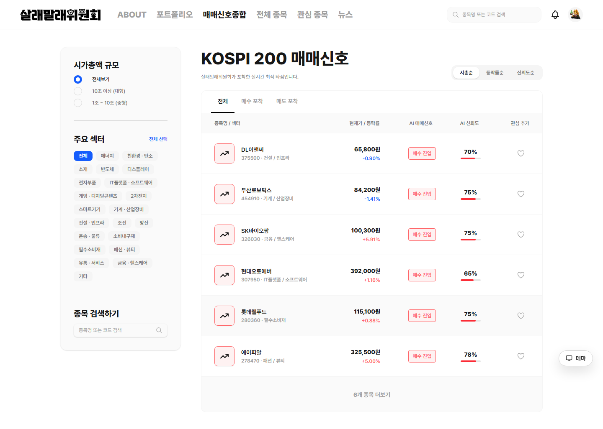
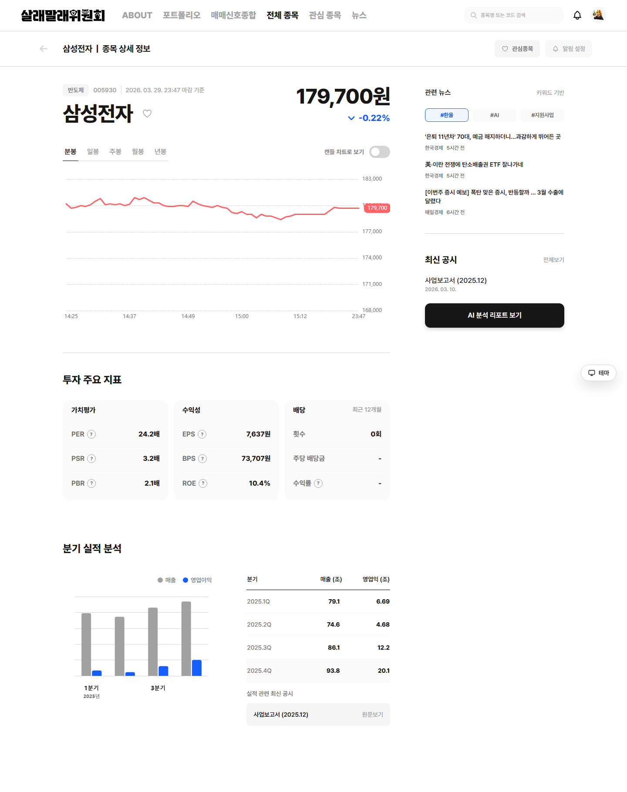
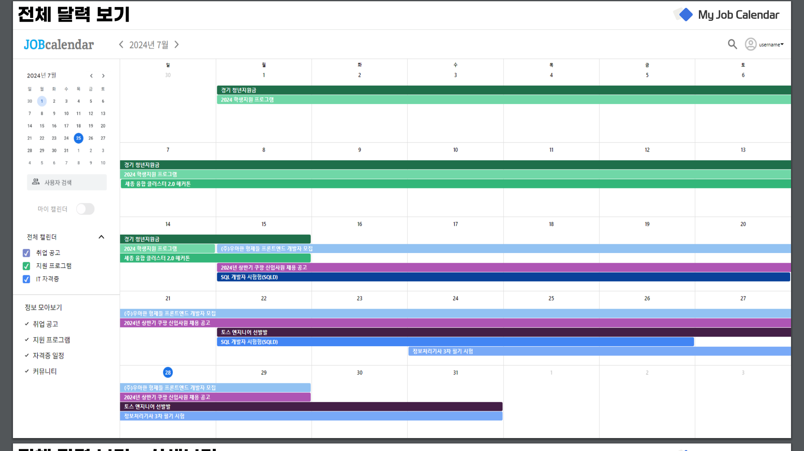
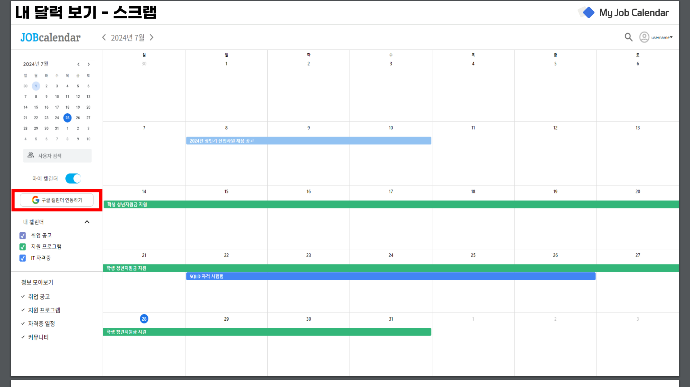

<!-- Screenshots are original files from the linked project READMEs. Sources: .github/profile/SOURCES.md. -->

# 정준용 · Jeong Jun Yong

**Full-Stack Developer** &nbsp; · &nbsp; Web / Backend / 3D

React·Next.js·Vue로 사용자 흐름을 만들고, Java·Spring으로 API와 데이터를 연결합니다. Unity·C#으로 책과 취향을 담는 3D 공간도 만들었습니다.

  <a href="#selected-work">Selected work</a> &nbsp; / &nbsp;
  <a href="#stack--tools">Stack &amp; tools</a> &nbsp; / &nbsp;
  <a href="#beyond-the-featured">More projects</a>

 

## Selected work

### [살래말래](https://github.com/beshurl/SallaeMallae)

시세·뉴스·재무 데이터와 AI 분석 결과를 한 화면에서 확인하는 주식 분석 서비스.

매매신호 종합 화면 · 이미지를 누르면 원본 크기로 볼 수 있습니다.

**담당** &nbsp; 주요 화면·API 연동, KIS 주식 시세 API, Redis 캐시 
**기술** &nbsp; Next.js · TypeScript · TanStack Query · Zustand · Spring Boot · Redis

<b>종목 상세 화면과 구현 내용 더 보기</b>

- 메인, 종목 목록·상세, 포트폴리오, 뉴스, 검색, 알림 화면과 API 연동
- OAuth, 프로필 이미지 업로드, 인기 검색어 SSE와 캐시·로딩 UX 개선
- KIS 기반 주식 조회·실시간 시세 API, Redis Top-list 캐시 구현

 

### [My Job Calendar](https://github.com/shipleaf/ITcampus_front)

취업공고·학생지원사업·자격증 일정을 모아 보고, 필요한 정보를 스크랩하는 캘린더 서비스.

전체 달력 화면 · 프로젝트 README에 수록된 발표 자료

**담당** &nbsp; 프론트엔드 개발 참여 
**기술** &nbsp; React · Recoil · styled-components · FullCalendar 
**팀 수상** &nbsp; SW융합클러스터 2.0 디지털 콘텐츠 DX 해커톤 우수상

<b>스크랩·Google Calendar 연동 화면 더 보기</b>

관심 있는 정보를 스크랩하고, 개인 캘린더에서 확인하거나 Google Calendar와 동기화할 수 있습니다.

 

## Stack & tools

프로젝트에서 사용한 기술과 도구를 영역별로 정리했습니다.

**Languages**

  
  
  
  
  

**Frontend & UI**

  
  
  
  
  
  

**State & data fetching**

  
  
  
  

**Backend & database**

  
  
  
  
  
   
  
  
  

**3D & interaction**

  
  
  

**Infrastructure & delivery**

  
  
  
  
  

**Testing & component development**

  
  
  
  
  

<b>라이브러리·서비스 구성 더 보기</b>

- **UI & forms** — HTML/CSS, React Hook Form, Zod, shadcn/ui, Radix UI, MUI, PrimeVue, Axios
- **Charts & motion** — ECharts, Chart.js, Motion / Framer Motion, AOS, FullCalendar
- **Backend & messaging** — REST API, Spring Security, OAuth 2.0, JWT, SSE, WebSocket, RabbitMQ, MyBatis, Flyway
- **Storage & deployment** — AWS S3·EC2, MinIO, MariaDB, H2, Docker Compose, Caddy
- **3D tooling** — Addressables, Cinemachine, URP, glTFast
- **Python & quality** — pandas, Pydantic, HTTPX, PyArrow, pytest, Ruff, Testing Library, MSW, ESLint, Prettier, Maven, Gradle

**프로토타입에서 시도한 기술** — GateStamp의 Android·iOS 프로토타입에서 Kotlin·Jetpack Compose, Swift·SwiftUI도 탐색했습니다.

<b>AI 서비스에서 연결한 시스템</b>

AI 프로젝트에서는 모델의 결과를 사용자가 이해하고 활용할 수 있는 화면과 서비스 흐름으로 연결했습니다. 아래는 참여 프로젝트의 AI·데이터 구성입니다.

- **살래말래** — LightGBM·TFT·GARCH 기반 앙상블, LLM 토론·분석, FinBERT 뉴스 감성 분석, TimescaleDB·pgvector
- **Bone To Be** — FastAPI 기반 AI 서버, MediaPipe·4D-Humans 체형 인식, PyTorch, WebRTC

개인 담당 내용은 위 프로젝트 소개에 구분해 두었습니다.

 

## Beyond the featured

**[DotShelf](https://github.com/beshurl/DotShelf)** &nbsp; `Unity` `C#` `Spring Boot`
 책과 취향을 담는 3D 책장. UI Toolkit, 씬 분리·지연 로딩, 원격 에셋 캐시와 S3 업로드 API 연동.

**[Bone To Be](https://github.com/beshurl/BoneToBe)** &nbsp; `React` `TypeScript` `styled-components`
 골격 인식 기반 의류 추천 서비스. 인증·프로필·커뮤니티 UI, API 연동과 메인 화면 애니메이션 담당.

**[Sequence](https://github.com/Sequence-Front/sequence)** &nbsp; `React` `TypeScript` `Recoil`
 대학생 개발자·디자이너의 프로젝트 협업 플랫폼. 프론트엔드 개발, 스타일 개선과 QA 참여.

**[GateStamp](https://github.com/beshurl/skala-temp-for-gain)** &nbsp; `Next.js` `Spring Boot` `Docker`
 공인 IP 검증과 당일 중복 확인을 적용한 출석 서비스.

**[WAYTHER](https://github.com/beshurl/skala-vue)** &nbsp; `Vue` `Pinia` `PrimeVue`
 날씨와 관광 정보를 연결해 방문 순서와 준비물을 제안하는 여행 서비스.

**[이걸주네?](https://github.com/beshurl/igeoljune)** &nbsp; `Vue` `Spring Boot` `PostgreSQL`
 취향·관계·예산 기반 선물 추천 프로젝트. Git 운영·코드 리뷰·통합과 파트 보조 담당.

 

[모든 저장소 보기 →](https://github.com/beshurl?tab=repositories)
