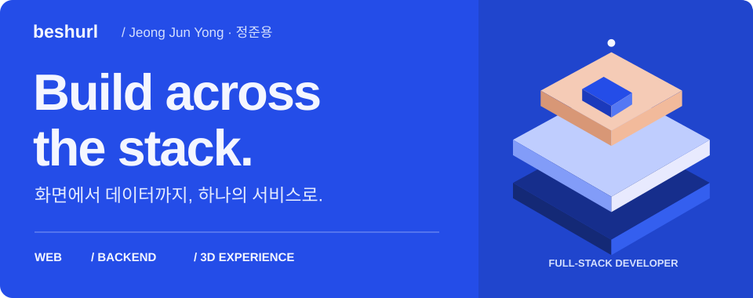
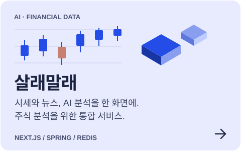
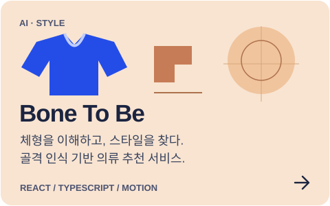
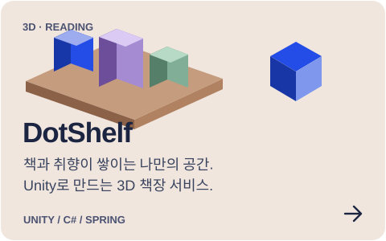
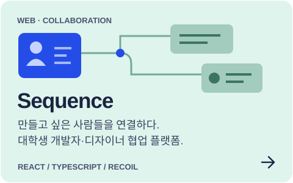

<!-- Original profile art: scripts/build-profile-assets.mjs. Content evidence: .github/profile/SOURCES.md. -->

<picture>
  <source media="(max-width: 600px)" srcset="./assets/hero-mobile.svg" />
  
</picture>

  <a href="#selected-work">Selected work</a> &nbsp; / &nbsp;
  <a href="#stack--tools">Stack &amp; tools</a> &nbsp; / &nbsp;
  <a href="#beyond-the-featured">More projects</a>

### 안녕하세요, 정준용입니다.

**웹의 인터랙션부터 백엔드 API, 3D 공간까지 연결하는 풀스택 개발자입니다.**

주식 시세와 AI 분석을 보여주는 화면, 체형에 맞는 스타일을 탐색하는 서비스, 책과 취향을 담는 3D 책장을 만들었습니다. React·Next.js·Vue로 사용자 흐름을 구현하고, Java·Spring과 데이터 저장소를 연결하며, Unity·C#으로 웹 밖의 인터랙션도 만들어갑니다.

화면 하나를 구현할 때도 **인증, 데이터 흐름, 로딩과 실패 상태까지** 함께 고민합니다.

 

## Selected work

  
  
  
  

<b>프로젝트에서 제가 맡은 일</b>

#### [살래말래](https://github.com/beshurl/SallaeMallae) · Frontend & Backend

- 메인, 종목 목록·상세, 포트폴리오, 뉴스, 검색, 알림 화면과 API 연동
- OAuth, 프로필 이미지 업로드, 인기 검색어 SSE와 캐시·로딩 UX 개선
- **KIS 기반 주식 조회·실시간 시세 API**, **Redis Top-list 캐시** 구현

#### [Bone To Be](https://github.com/beshurl/BoneToBe) · Frontend

- 회원가입·로그인·소셜 인증부터 프로필·마이페이지까지 사용자 흐름 구현
- 커뮤니티, 사용자 검색, 알림 기능과 API 연동
- **메인 화면 애니메이션**과 인터랙티브한 서비스 소개 구현

#### [DotShelf](https://github.com/beshurl/DotShelf) · Unity & Backend Integration

- **Unity UI Toolkit** 기반 책장·노트북·책 시장 UI와 API 연동
- 씬 분리, UI 지연 로딩, 원격 에셋 캐시와 다른 사용자의 공간 방문 UX
- Spring 기반 **S3 Presigned URL 썸네일 업로드 API**, 스킨·책장 상태 동기화

#### [Sequence](https://github.com/Sequence-Front/sequence) · Frontend

- 대학생 개발자·디자이너의 프로젝트 모집·협업 플랫폼 프론트엔드 참여
- React·TypeScript·Recoil·styled-components 기반 화면, 스타일 개선과 QA

 

## Stack & tools

프로젝트에서 사용한 기술과 도구를 영역별로 정리했습니다.

**Languages**

  
  
  
  
  

**Frontend & UI**

  
  
  
  
  
  

**State & data fetching**

  
  
  
  

**Backend & database**

  
  
  
  
  
   
  
  
  

**3D & interaction**

  
  
  

**Infrastructure & delivery**

  
  
  
  
  

**Testing & component development**

  
  
  
  
  

<b>라이브러리·서비스 구성 더 보기</b>

- **UI & forms** — HTML/CSS, React Hook Form, Zod, shadcn/ui, Radix UI, MUI, PrimeVue, Axios
- **Charts & motion** — ECharts, Chart.js, Motion / Framer Motion, AOS, FullCalendar
- **Backend & messaging** — REST API, Spring Security, OAuth 2.0, JWT, SSE, WebSocket, RabbitMQ, MyBatis, Flyway
- **Storage & deployment** — AWS S3·EC2, MinIO, MariaDB, H2, Docker Compose, Caddy
- **3D tooling** — Addressables, Cinemachine, URP, glTFast
- **Python & quality** — pandas, Pydantic, HTTPX, PyArrow, pytest, Ruff, Testing Library, MSW, ESLint, Prettier, Maven, Gradle

**프로토타입에서 시도한 기술** — GateStamp의 Android·iOS 프로토타입에서 Kotlin·Jetpack Compose, Swift·SwiftUI도 탐색했습니다.

<b>AI 서비스에서 연결한 시스템</b>

AI 프로젝트에서는 모델의 결과를 사용자가 이해하고 활용할 수 있는 화면과 서비스 흐름으로 연결했습니다. 아래는 참여 프로젝트의 AI·데이터 구성입니다.

- **살래말래** — LightGBM·TFT·GARCH 기반 앙상블, LLM 토론·분석, FinBERT 뉴스 감성 분석, TimescaleDB·pgvector
- **Bone To Be** — FastAPI 기반 AI 서버, MediaPipe·4D-Humans 체형 인식, PyTorch, WebRTC

개인 담당 내용은 위 프로젝트 소개에 구분해 두었습니다.

 

## Beyond the featured

**[GateStamp](https://github.com/beshurl/skala-temp-for-gain)** &nbsp; `Next.js` `Spring Boot` `Docker`
 공인 IP 검증과 당일 중복 확인을 적용한 출석 서비스.

**[WAYTHER](https://github.com/beshurl/skala-vue)** &nbsp; `Vue` `Pinia` `PrimeVue`
 날씨와 관광 정보를 연결해 방문 순서와 준비물을 제안하는 여행 서비스.

**[My Job Calendar](https://github.com/shipleaf/ITcampus_front)** &nbsp; `React` `Recoil` `FullCalendar`
 취업·학생지원·자격증 정보를 모아 관리하는 캘린더. 프론트엔드 참여.
 팀 수상 · SW융합클러스터 2.0 디지털 콘텐츠 DX 해커톤 우수상

**[이걸주네?](https://github.com/beshurl/igeoljune)** &nbsp; `Vue` `Spring Boot` `PostgreSQL`
 취향·관계·예산 기반 선물 추천 프로젝트. Git 운영·코드 리뷰·통합과 파트 보조 담당.

 

Designed around the things I build. · <a href="./.github/profile/SOURCES.md">Design &amp; source notes</a>

